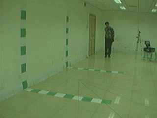
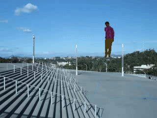
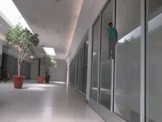
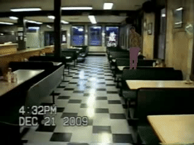

# augset

| Original Video |
|----------------|
|  |

<table>
 <tr>
  <td align="center"></td>
  <td align="center"></td>
  <td align="center"></td>
  <td align="center"></td>
  <td align="center"></td>
 </tr>
 <tr>
  <td align="center"></td>
  <td align="center"></td>
  <td align="center"></td>
  <td align="center"></td>
  <td align="center"></td>
 </tr>
</table>

## Installation
You should set the environment variable manually as follows if you want to build a local GPU environment for Grounded-SAM:
```bash
export AM_I_DOCKER=False
export BUILD_WITH_CUDA=True
export CUDA_HOME=/path/to/cuda-11.3/
```

#### Segment Anything
```bash
python -m pip install -e segment_anything
```

#### GroundingDino
```bash
python -m pip install -e GroundingDINO
```

#### Blending Utils
```bash
python -m pip install pyblur
```

[Update pyblur](https://github.com/lospooky/pyblur/issues/5#issue-309942237)

## Pre-Trained Weights
```
wget https://github.com/IDEA-Research/GroundingDINO/releases/download/v0.1.0-alpha/groundingdino_swint_ogc.pth
wget https://dl.fbaipublicfiles.com/segment_anything/sam_vit_h_4b8939.pth
```
